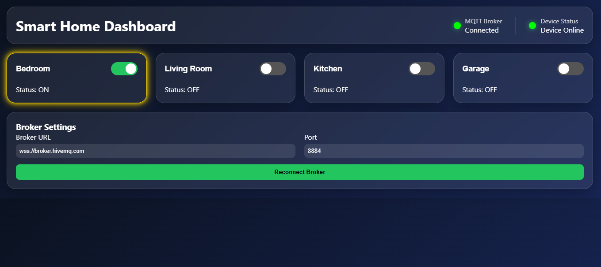
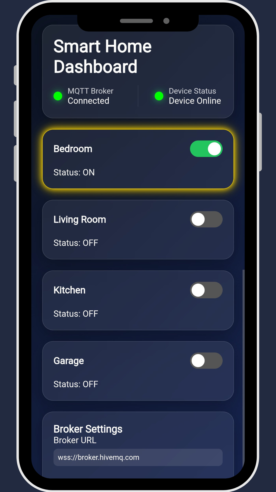

# Smart Home Project

A lightweight MQTT-based Smart Home Automation system built using ESP32, MQTT, and a responsive web dashboard.

The project allows real-time control and monitoring of multiple home appliances through MQTT topics and a browser-based dashboard.

## Features

* ESP32-based firmware
* MQTT communication using PubSubClient
* JSON command processing
* Real-time device control
* Device status synchronization
* Heartbeat monitoring
* Responsive web dashboard
* Room-based appliance control
* Easy MQTT broker configuration

## System Architecture

```text
+-------------+        MQTT         +-------------+
| Web Browser | <-----------------> | MQTT Broker |
+-------------+                     +-------------+
        ^                                   ^
        |                                   |
        |                                   |
        v                                   v
+-----------------------------------------------+
|                   ESP32                       |
|                                               |
|  Bedroom Light    -> GPIO16                   |
|  Living Room      -> GPIO17                   |
|  Kitchen Light    -> GPIO18                   |
|  Garage Light     -> GPIO19                   |
+-----------------------------------------------+
```

## Hardware

| Component           | Description       |
| ------------------- | ----------------- |
| ESP32               | Main Controller   |
| Relay Module / LEDs | Appliance Control |
| Wi-Fi Network       | Connectivity      |
| MQTT Broker         | Message Transport |

## Software Stack

* Arduino Framework
* PlatformIO
* MQTT (PubSubClient)
* ArduinoJson
* HTML
* CSS
* JavaScript


## GPIO Mapping

| Device            | GPIO   |
| ----------------- | ------ |
| Bedroom Light     | GPIO16 |
| Living Room Light | GPIO17 |
| Kitchen Light     | GPIO18 |
| Garage Light      | GPIO19 |

## MQTT Topics

### Command Topics

| Topic                     | Description               |
| ------------------------- | ------------------------- |
| addyhome/bedroom/light    | Bedroom Light Control     |
| addyhome/livingroom/light | Living Room Light Control |
| addyhome/kitchen/light    | Kitchen Light Control     |
| addyhome/garage/light     | Garage Light Control      |

Example Payload:

```json
{
  "state": 1
}
```

### Status Topics

| Topic                            |
| -------------------------------- |
| addyhome/bedroom/light/status    |
| addyhome/livingroom/light/status |
| addyhome/kitchen/light/status    |
| addyhome/garage/light/status     |

Payload:

```text
ON
OFF
```

### Heartbeat Topic

```text
addyhome/status
```

Payload:

```text
ONLINE
```

For detailed topic documentation, see MQTT_TOPICS.md.

## Dashboard Preview

### Main Dashboard



### Mobile View

<p align="center">
  
</p>

> Update the filenames above to match the actual images in `docs/images`.

## Getting Started

### Clone Repository

```bash
git clone https://github.com/Aadhil-M/smart-home.git
```

### Configure Wi-Fi and MQTT

Create a `config.h` file:

```cpp
#define WIFI_SSID     "YOUR_WIFI"
#define WIFI_PASSWORD "YOUR_PASSWORD"

#define MQTT_SERVER   "broker.hivemq.com"
#define MQTT_PORT     1883

#define LIGHT_01 16
#define LIGHT_02 17
#define LIGHT_03 18
#define LIGHT_04 19
```

### Build and Upload

Using PlatformIO:

```bash
pio run
pio run --target upload
```

### Open Dashboard

Open:

```text
dashboard/index.html
```

Configure the MQTT broker settings and connect.

## Future Improvements

* MQTT Authentication
* TLS/SSL Support
* Device Discovery
* OTA Firmware Updates
* Home Assistant Integration
* Sensor Monitoring
* Energy Consumption Tracking
* Room Configuration Management

## License

This project is released under the MIT License.

## Author

Aadhil

Embedded Software Engineer

Focused on:

* Embedded Systems
* IoT Development
* ESP32
* nRF52/54 series
* STM32
* MQTT
* BLE
* LoRa
* Wireless Communication
